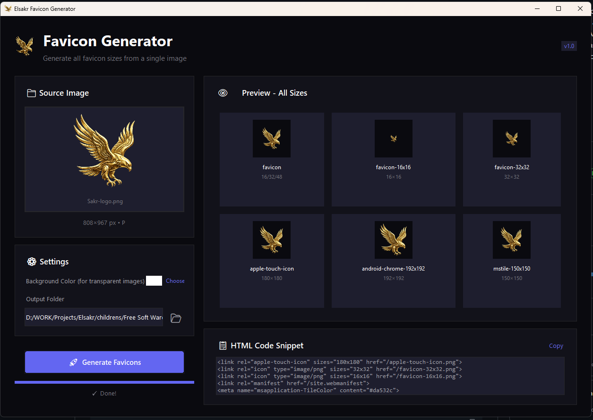

# 🦅 Elsakr Favicon Generator

  

> **Part of Elsakr Open Source Tools Ecosystem — [View All Tools](https://elsakr.company/tools)**  
> *Your website deserves a proper favicon. Not a blurry icon. Not a random crop.*

---

## ⭐ Badges

## 📋 Table of Contents
- [🦅 Elsakr Favicon Generator](#-elsakr-favicon-generator)
  - [⭐ Badges](#-badges)
  - [📋 Table of Contents](#-table-of-contents)
  - [🧐 What is it?](#-what-is-it)
  - [✨ Features](#-features)
  - [📦 Usage](#-usage)
  - [🤝 Contributing](#-contributing)
  - [📜 License](#-license)
  - [📞 Contact](#-contact)
  - [🇪🇬 Arabic Version / النسخة العربية](#-arabic-version--النسخة-العربية)

---

## 🧐 What is it?
**Elsakr Favicon Generator** is a smart desktop utility that takes a single high-resolution logo and automatically generates **every** favicon size required by modern web standards (ICO, PNGs for Android, Apple Touch Icons, etc.). It ensures your brand looks crisp on every device.

## ✨ Features
- **All Standards**: Generates `.ico`, `16x16`, `32x32`, `192x192` (Android), `180x180` (Apple).
- **Quality Preservation**: Uses high-quality resampling filters.
- **Drag & Drop**: Simple GUI interface.
- **100% Local**: Privacy focused, no uploads.

## 📦 Usage

1. **Launch**: Open the application.
2. **Import**: Drag & Drop your high-res logo.
3. **Configure**: Adjust background or padding if needed.
4. **Generate**: Click "Process" and get a zip file with everything ready for production.

---

## 🤝 Contributing
We welcome contributions! Whether it's fixing bugs, improving the UI, or adding new formats.
1. Fork the repo.
2. Create your branch (`git checkout -b feature/AmazingFeature`).
3. Commit your changes.
4. Push to the branch.
5. Open a Pull Request.

## 📜 License
Distributed under the MIT License. See `LICENSE` for more information.

## 📞 Contact
**Elsakr Tools** - [elsakr.company](https://elsakr.company)  
*Open Source Tools with a Falcon’s Vision.*

---

# 🇪🇬 Arabic Version / النسخة العربية

# 🦅 Elsakr Favicon Generator (مولد الأيقونات)

  

> **جزء من نظام صقر للأدوات مفتوحة المصدر — [عرض كل الأدوات](https://elsakr.company/tools)**  
> *موقعك يستحق أيقونة احترافية. مش أيقونة مبكسلة أو مقصوصة غلط.*

---

## 🧐 ما هي هذه الأداة؟
أداة سطح مكتب ذكية تأخذ اللوجو الخاص بك بدقة عالية وتقوم تلقائيًا بإنتاج **جميع** المقاسات المطلوبة للمعايير الحديثة (ICO للمتصفحات، PNGs للأندرويد، Apple Touch Icons للآيفون، وغيرها). تضمن أن علامتك التجارية تظهر بشكل مثالي على كل الأجهزة.

## ✨ المميزات
- **شاملة**: تنتج `.ico`, `16x16`, `32x32`, `192x192`, `180x180`.
- **جودة عالية**: تحافظ على دقة الصور أثناء التصغير.
- **سهولة الاستخدام**: واجهة بسيطة تدعم السحب والإفلات.
- **خصوصية 100%**: معالجة محلية بالكامل، لا يتم رفع صورك لأي سيرفر.

## 📦 طريقة الاستخدام
1. **شغل البرنامج**: افتح التطبيق.
2. **استيراد**: اسحب اللوجو وضعه في البرنامج.
3. **تخصيص**: اضبط الخلفية إذا احتجت.
4. **توليد**: اضغط زر المعالجة واستلم ملف جاهز للرفع على موقعك فورًا.

## 📞 تواصل معنا
**أدوات صقر** - [elsakr.company](https://elsakr.company)  
*أدوات مفتوحة المصدر برؤية صقر.*
